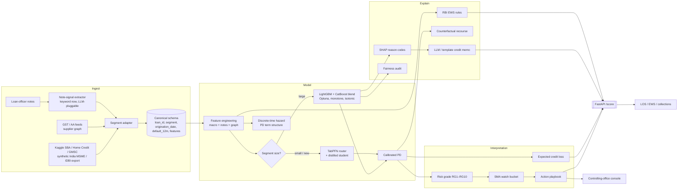
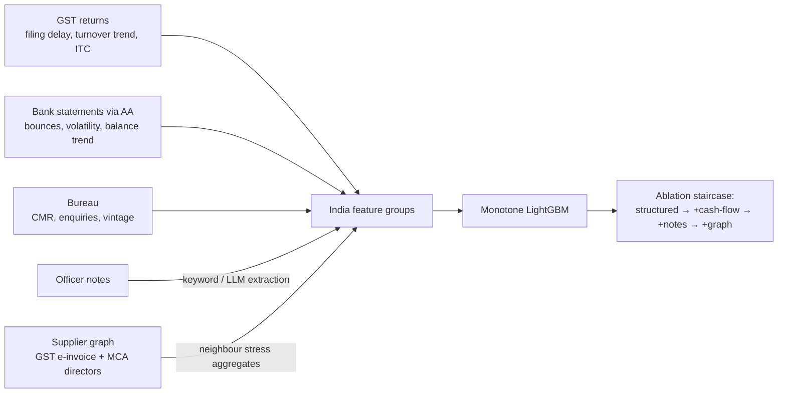
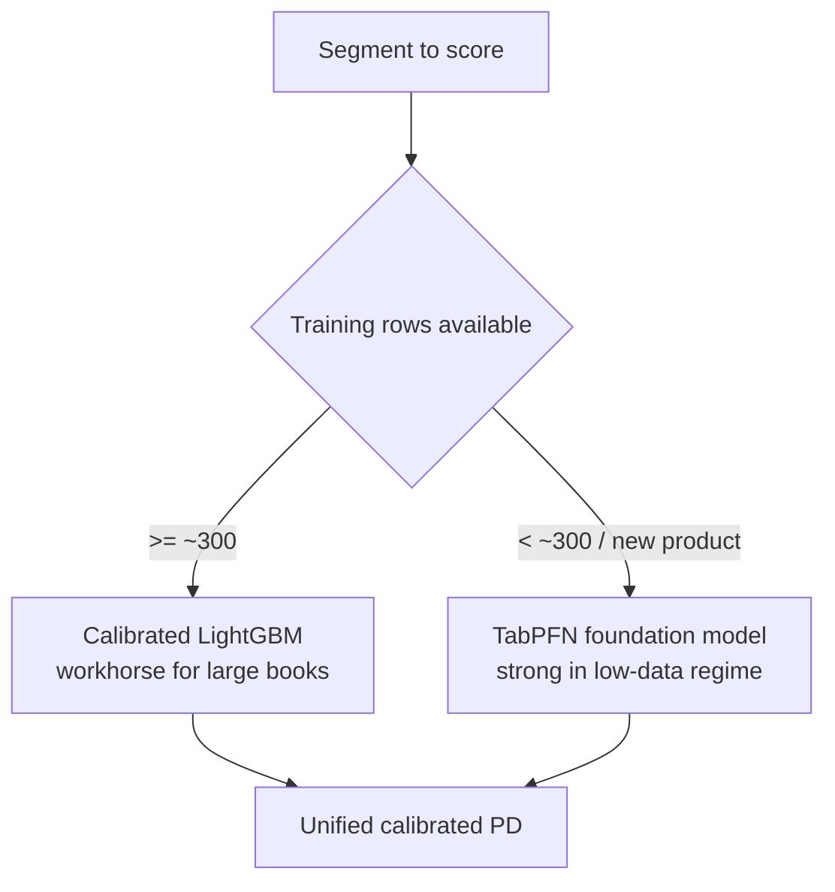
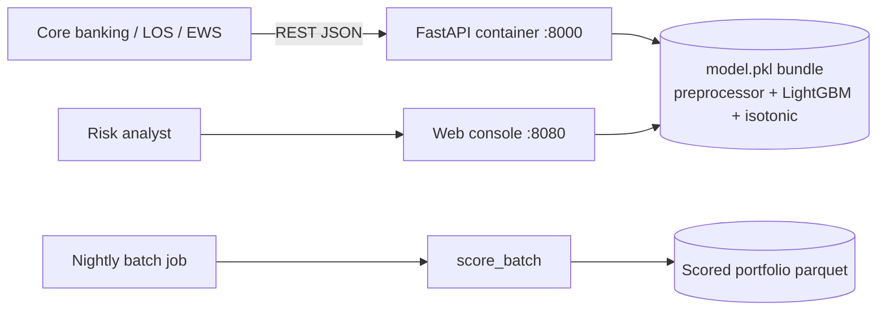
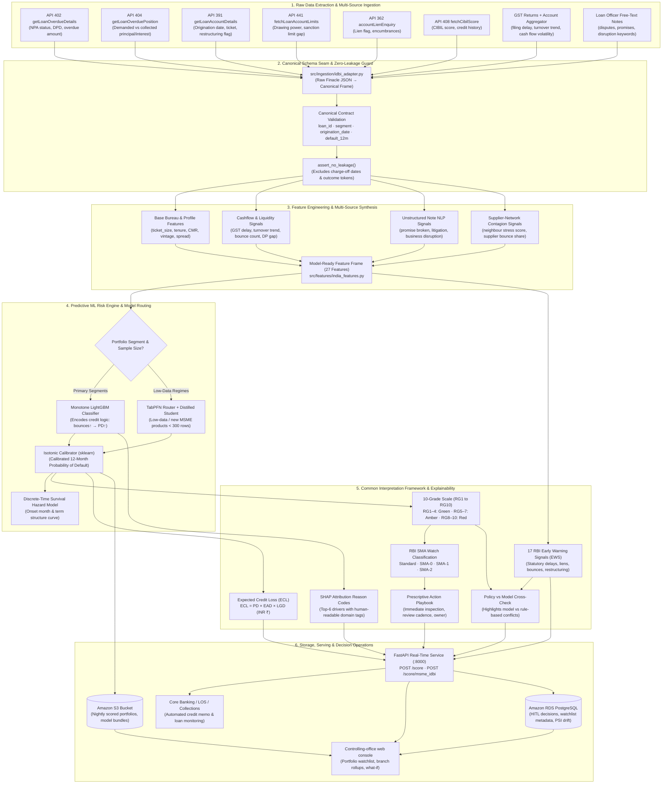

# Architecture — DRISHTI (IDBI PS4 Loan Stress Engine)

## System flow

## The canonical schema is the IDBI-swappable seam

Every dataset (SBA / Home Credit / GMSC / synthetic India today, IDBI sandbox
tomorrow) is mapped by a thin **adapter** into one contract: `loan_id, segment,
origination_date, default_12m` + features. Everything downstream — features,
models, framework, serving — is unchanged when IDBI data replaces the public
data. New segments register in `src/config.py` + `src/serving/segments.py`.

## India MSME data plane (synthetic now, AA/GST live later)

## Model routing

## Deployment topology

- **Real-time**: `POST /score` for underwriting / monitoring hooks.
- **Batch**: `score_batch` for nightly portfolio re-scoring → watchlists + ECL.
- **Human**: the console for drill-down, scenarios and model health.

## AWS Production Solution Architecture

The system is optimized for IDBI Bank's AWS sandbox environment (`ap-south-1`) across compute, storage, security, and observability tiers:

```mermaid
flowchart TB
    subgraph EXT["External Systems & Consumers"]
        direction LR
        LOS["Core Banking / LOS / Collections\n(Real-time scoring hook)"]
        RISK["Controlling Office / Risk Managers
(Web console :8080)"]
        PORTAL["Bank sandbox portal"]
    end

    subgraph AWS["IDBI AWS Cloud Environment (Region: ap-south-1)"]
        direction TB

        subgraph EDGE["Perimeter & Ingress"]
            WAF["AWS WAF + Shield\n(Allowlist: team egress CIDR)"]
            ALB["Application Load Balancer (ALB)\n(TLS termination, path-based routing)"]
            WAF --> ALB
        end

        subgraph ECS_CLUSTER["Container Serving Layer (ECS Fargate)"]
            direction LR
            API["FastAPI Scorer Service\n1–2 vCPU / 4–8 GB\n(:8000 · autoscale 2–4 tasks)"]
            CONSOLE["Controlling-office web console
1-2 vCPU / 4-8 GB
(:8080)"]
            BATCH["Nightly score_batch Task\n2 vCPU / 8 GB (Fargate)\n(1–2 hrs nightly execution)"]
        end

        subgraph SM["Optional SageMaker Real-Time Endpoint"]
            SM_EP["SageMaker Endpoint\n(ml.m5.large · msme_india segment)"]
        end

        subgraph COMPUTE_EC2["Model Training & Refinement Layer (EC2)"]
            EC2_TR["EC2 Training Worker\n1× m5.2xlarge / c5.2xlarge\n8 vCPU / 16–32 GB RAM\n(Optuna, TabPFN, survival, ablations)"]
            EC2_GPU["Optional 1× g4dn.xlarge\n(FinBERT note-sentiment fine-tuning)"]
        end

        subgraph STORAGE["Persistence & Data Lake Layer"]
            direction LR
            RDS[("Amazon RDS PostgreSQL\n(db.t3.micro → db.t3.small)\nHITL decisions, watchlist metadata,\nPSI drift & fairness audit history")]
            S3[("Amazon S3 Bucket (100–200 GB)\nraw sandbox extracts, processed parquet,\nmodel bundles (1–2 GB), scored portfolios")]
            ECR[("Amazon ECR (10–20 GB)\nidbi-ps4-risk-engine container images")]
        end

        subgraph MGMT["Observability & Automation"]
            direction LR
            CW["CloudWatch Logs & Metrics\n(PSI > 0.25 drift alarm)"]
            EB["EventBridge Scheduler\n(Nightly 01:00 cron trigger)"]
            SMGR["AWS Secrets Manager\n(Database credentials & API keys)"]
        end
    end

    LOS -->|HTTPS REST| WAF
    RISK -->|HTTPS| WAF
    ALB -->|/score · /health| API
    ALB -->|/console| CONSOLE
    EB -->|Trigger nightly run| BATCH

    ECR -.->|Pull images| ECS_CLUSTER
    SMGR -.->|Inject secrets| ECS_CLUSTER
    SMGR -.->|Inject secrets| COMPUTE_EC2

    PORTAL -.->|Extract Finacle JSONs| BATCH
    PORTAL -.->|Extract Finacle JSONs| EC2_TR

    API -->|Read model bundle| S3
    CONSOLE -->|Read scored portfolios| S3
    BATCH -->|Load canonical parquet| S3
    BATCH -->|Write scored portfolios| S3
    EC2_TR -->|Read parquet / write model.pkl| S3

    API -->|Log HITL decisions| RDS
    CONSOLE -->|Read/write HITL audit trail| RDS
    BATCH -->|Record execution stats & PSI| RDS

    API -.->|Emit metrics| CW
    BATCH -.->|Emit PSI & ECL metrics| CW
    CW -.->|Drift alert trigger| RISK

    LOS -.->|Direct inference| SM_EP
    SM_EP -->|Read model.pkl| S3
```

---

## End-to-End Data Flow Architecture

The data pipeline enforces the canonical schema seam with strict zero-leakage guards from Finacle sandbox APIs through to controlling office decisioning:

---

## Compute & Storage Sizing / Cost Breakdown

| Component | AWS Resource | Sizing & Configuration | Role & Usage Pattern | Estimated Monthly Cost |
|---|---|---|---|---|
| **Training & Refinement** | EC2 `m5.2xlarge` / `c5.2xlarge` | 8 vCPU, 16–32 GB RAM (Spot / On-Demand) | Optuna retrain, feature ablation, TabPFN distillation, sandbox adapter (~40–80 hrs/mo) | ~$15 – $35 / month |
| **GPU Refinement (Opt)** | EC2 `g4dn.xlarge` | 4 vCPU, 16 GB RAM, 1× NVIDIA T4 (16 GB) | FinBERT officer note sentiment fine-tuning (~10–20 hrs/mo) | ~$5 – $12 / month |
| **Real-Time API Serving** | ECS Fargate | 1–2 vCPU, 4–8 GB (autoscale 1–4 tasks) | Core banking LOS/EWS real-time scoring (`POST /score`), p95 < 25ms | ~$25 – $50 / month |
| **Console serving** | ECS Fargate | 1-2 vCPU, 4-8 GB (1 task) | Controlling-office React console (:8080) | ~$25 - $50 / month |
| **Nightly Batch Task** | ECS Fargate (Task) | 2 vCPU, 8 GB | EventBridge-triggered portfolio batch scoring (`score_batch`, ~1–2 hrs/night) | ~$5 – $10 / month |
| **SageMaker Endpoint (Opt)** | SageMaker `ml.m5.large` | 2 vCPU, 8 GB | Dedicated real-time endpoint for India MSME segment demo | ~$85 / month (or spin-down) |
| **Relational Database** | Amazon RDS PostgreSQL | `db.t3.micro` → `db.t3.small` (20–50 GB gp3) | HITL audit trail, scored watchlist metadata, PSI/fairness run history | ~$15 – $30 / month |
| **Object Storage** | Amazon S3 Standard | 100–200 GB | Raw sandbox extracts, Parquet feature store, model bundles (~1–2 GB), scored portfolios | ~$3 – $5 / month |
| **Container Registry** | Amazon ECR | 10-20 GB | Immutable versioned container images for the API and batch tasks | ~$1 - $2 / month |
| **Observability** | Amazon CloudWatch | Standard logs & metric alarms | Application logs, API latency, PSI drift alarms (trigger at PSI > 0.25) | ~$5 / month |
| **Total Deployment Cost** | — | — | **Fully managed, auto-scaling, production bank grade** | **~$95 – $190 / month** |

---

## Governance & Compliance Hooks

- **Isotonic Calibration**: Monotone reliability mapping ensures reported PD matches empirical default frequency.
- **SHAP Reason Codes + RBI EWS Triggers**: Every account delivers auditable top-6 drivers plus 17 RBI Fraud Risk Master Direction indicators.
- **Fairness Audit**: 4/5ths disparate-impact rule verification per protected demographic attribute.
- **Monotone Constraints**: Credit domain monotonicity enforced at training (higher bounces or higher DP erosion strictly increases default probability).
- **Automated Drift (PSI) Monitoring**: CloudWatch & RDS alert automatically triggers recalibration when PSI > 0.25.

